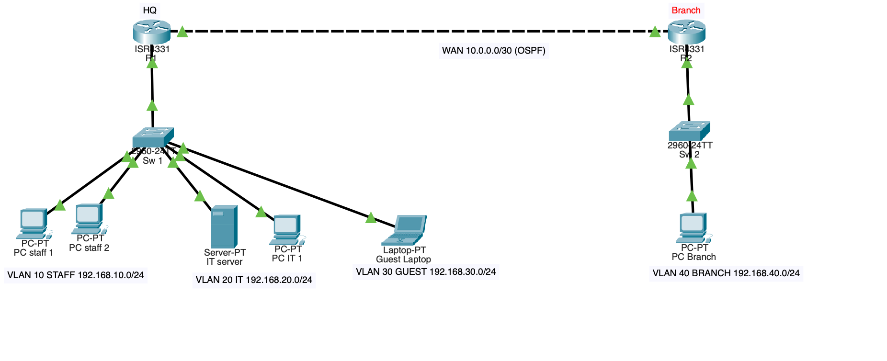
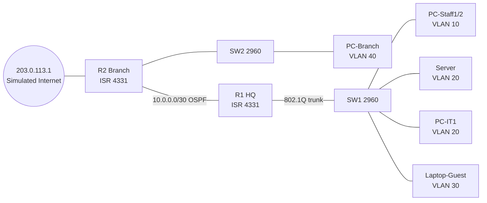
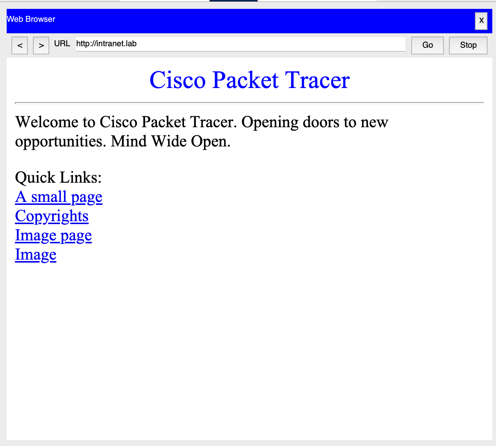
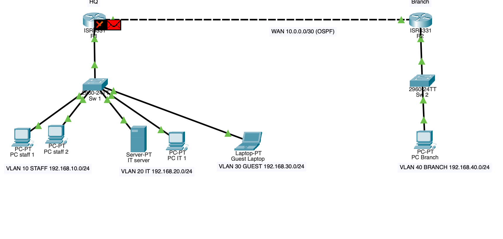
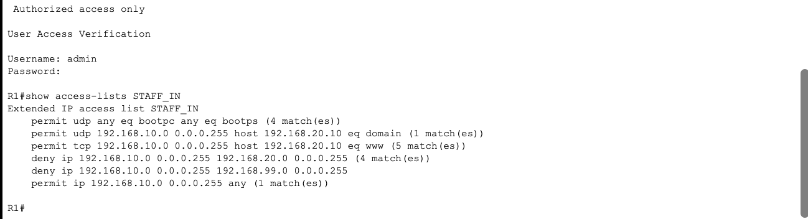
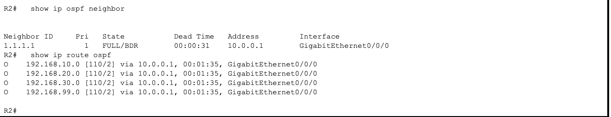

# Two-Site Segmented Network Lab (Cisco Packet Tracer)

> **Status: in progress.** Configs and screenshots are in; the `.pkt` file and build notes are still being added.

A small enterprise network built to practice CCNA skills: VLAN segmentation, router-on-a-stick inter-VLAN routing, per-subnet DHCP, OSPF between two sites, extended ACLs that enforce a security policy, SSH-only device management, and switch port hardening.

## Topology

## Addressing plan

| Site | VLAN | Name | Subnet | Gateway | Notes |
|---|---|---|---|---|---|
| HQ | 10 | STAFF | 192.168.10.0/24 | .1 | DHCP, filtered by STAFF_IN |
| HQ | 20 | IT | 192.168.20.0/24 | .1 | DHCP; Server static at .10 |
| HQ | 30 | GUEST | 192.168.30.0/24 | .1 | DHCP (no DNS handed out), filtered by GUEST_IN |
| HQ | 99 | MGMT | 192.168.99.0/24 | .1 | SW1 SVI at .2 |
| HQ | 999 | NATIVE | — | — | Unused native VLAN on trunk |
| Branch | 40 | BRANCH | 192.168.40.0/24 | .1 | DHCP from R2; SW2 SVI at .2 |
| WAN | — | R1–R2 | 10.0.0.0/30 | — | OSPF area 0 |
| — | — | Internet (sim) | 203.0.113.1 | — | Loopback on R2 |

## Security policy

| Source | Allowed | Blocked |
|---|---|---|
| Staff (VLAN 10) | Web and DNS on the IT server, branch, internet | All other IT traffic, MGMT |
| Guest (VLAN 30) | Internet only | Every internal subnet |
| IT (VLAN 20) | Everything, plus SSH to all devices | — |
| Branch (VLAN 40) | Everything | SSH to network devices |

The ACLs are stateless, so STAFF_IN and GUEST_IN let `echo-reply` and TCP `established` packets back to the IT subnet. Without those lines, IT could not reach Staff or Guest hosts. Guests get no DNS server, because the only one sits on the internal IT subnet. Test guest access by IP.

## Build steps

1. **Place devices:** 2× ISR 4331 (R1, R2), 2× 2960-24TT (SW1, SW2), one Server, PCs as shown.
2. **Cable:**
   - R1 G0/0/0 ↔ R2 G0/0/0
   - R1 G0/0/1 ↔ SW1 Gi0/1
   - R2 G0/0/1 ↔ SW2 Gi0/1
   - SW1: Staff PCs on Fa0/1–2, Server on Fa0/6, PC-IT1 on Fa0/7, Guest laptop on Fa0/11
   - SW2: PC-Branch on Fa0/1
3. **Configure** each device from the files in `configs/`. Typing them builds CCNA muscle memory faster than pasting. Change `ChangeMe!23` to your own lab password.
4. **Server:** set a static IP of 192.168.20.10/24 with gateway 192.168.20.1. Turn on the HTTP service and the DNS service, then add an A record: `intranet.lab → 192.168.20.10`.
5. **Clients:** set every PC to DHCP and confirm each one gets an address from the right subnet.

## Verification

| Check | Command | Expected |
|---|---|---|
| VLANs exist and ports are assigned | `show vlan brief` (SW1) | Fa0/1–5 in 10, 6–10 in 20, 11–15 in 30 |
| Trunk is up | `show interfaces trunk` (SW1) | Gi0/1 trunking, native 999 |
| Subinterfaces are up | `show ip interface brief` (R1) | All .x subinterfaces up/up |
| OSPF adjacency | `show ip ospf neighbor` | FULL with the other router |
| Routes learned | `show ip route ospf` (R1) | 192.168.40.0/24 and 203.0.113.1/32 (OSPF advertises loopbacks as host routes) |
| DHCP leases | `show ip dhcp binding` | One lease per client |
| ACLs are matching | `show access-lists` | Hit counters increase during tests |
| Port security | `show port-security interface fa0/1` | Secure-up, sticky MAC learned |

## Policy tests

| From | Test | Expected |
|---|---|---|
| Staff PC | Browser → `intranet.lab` | Page loads |
| Staff PC | `ping 192.168.20.10` | Fails (ICMP blocked) |
| Staff PC | `ping 192.168.40.x` | Succeeds |
| Guest laptop | `ping 203.0.113.1` | Succeeds |
| Guest laptop | `ping 192.168.20.10` | Fails |
| IT PC | `ssh -l admin 192.168.99.2` | Logs into SW1 |
| IT PC | `ssh -l admin 192.168.40.2` | Logs into SW2 |
| IT PC | `ping` a Staff PC | Succeeds (reply allowed by `echo-reply`) |
| Staff PC | `ssh -l admin 192.168.10.1` | Refused (MGMT_ONLY) |
| Branch PC | Browser → `intranet.lab` | Page loads |

Use **Simulation mode** to watch a blocked packet die at R1's subinterface.

## Results

| Staff web access allowed | Staff ping to IT server blocked |
|---|---|
|  |  |

**Guest packet dropped at R1 (Simulation mode)**

**ACL hit counters on R1** (`show access-lists STAFF_IN`)

**OSPF adjacency and learned routes on R2**

## Break/fix exercises (interview practice)

Break one thing at a time, find the cause using only `show` commands, then fix it. Write down your steps.

1. Change SW1's trunk native VLAN to 1. What symptoms appear?
2. Change subinterface .10 to `encapsulation dot1Q 11`. Who loses connectivity? (IOS rejects VLAN 30 there because .30 already uses it.)
3. Remove the `bootpc/bootps` line from GUEST_IN. Why does DHCP break?
4. Make R2's OSPF network statement for 10.0.0.0 use the wrong wildcard. What does `show ip ospf neighbor` show?
5. Put a hub on a Staff port and connect three laptops to it. The port allows 2 MACs, so the third one triggers port security. Watch it react.

## Repo checklist

- [ ] `lab.pkt`: the saved Packet Tracer file
- [x] `configs/`: device configs (R1, R2, SW1, SW2)
- [x] `screenshots/`: topology, passing and blocked policy tests, Simulation-mode drop, ACL counters, OSPF neighbors (see `screenshots/README.md`)
- [ ] `NOTES.md`: build log, what broke and how I fixed it, break/fix results

## Phase 2 (planned)

Rebuild the segmentation on pfSense in a VM lab, adding Suricata IDS. Compare firewall rules there with these router ACLs.
